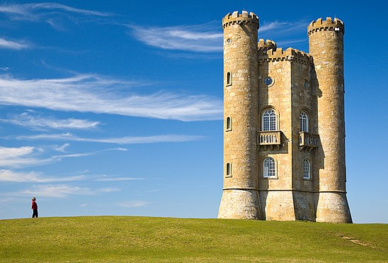
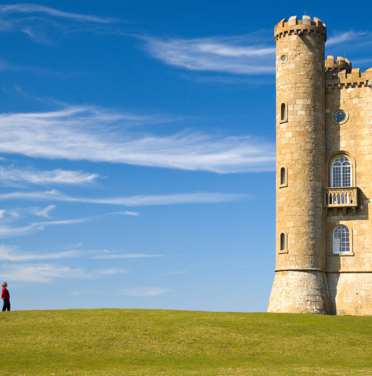
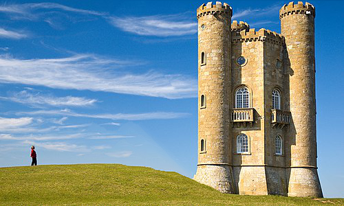
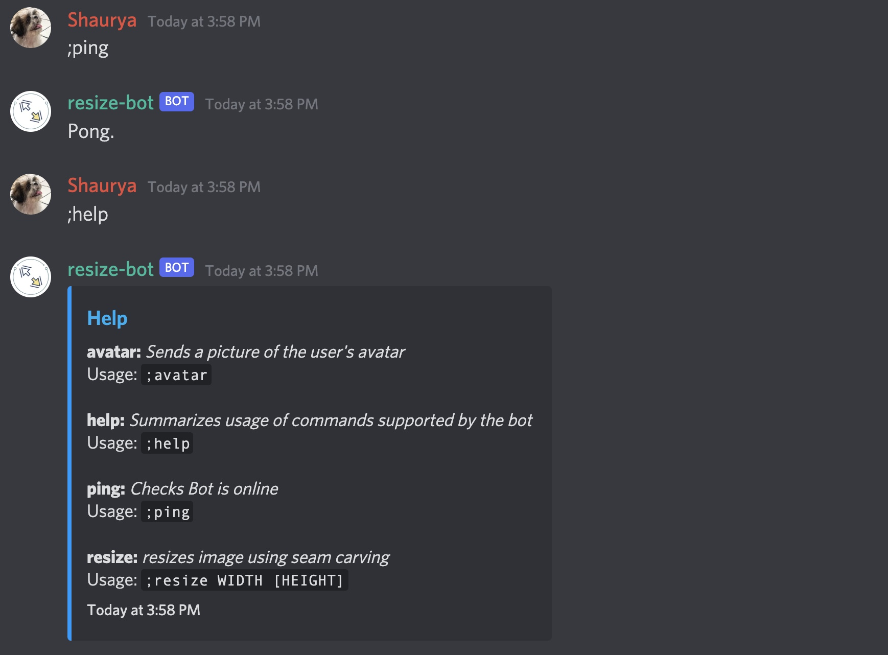
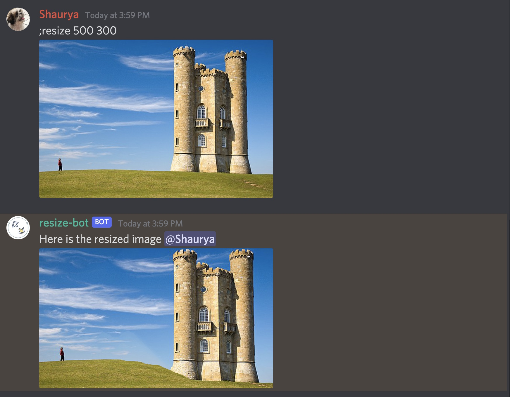

# Resize Bot
Content Aware Image Resizing Discord Bot.
----------------
Uses Seam Carving to resize image to dimensions specified by user without distortion or loss of important features.

Seam Carving Example
-----------------------------
**Original:** 

**Cropped:**

**Re-scaled:**

**Re-sized:**

*Original Example Image from [Wikipedia](https://en.wikipedia.org/wiki/Seam_carving), Modified with Resize-bot*

Prefix Used: `;` by default. Can be changed by changing the value `prefix` defined in `config.json` (`config.prefix`).

Sample Command Usage:

 - `;ping`: Simple command to verify normal operation of the bot.
 - `;help`: Summarise Usage of commands supported by bot. 
 - `;avatar`: Sends a picture of the User's avatar in a discord channel to enable manipulation.
 - `;resize WIDTH [HEIGHT]`: Resizes Image sent by the user to the width and height specified. The heigh argument is optional; if height is not specified the original height of the image is retained.
 
Example bot usage on discord:

