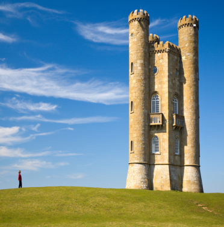

# Resize Bot
Content Aware Image Resizing Discord Bot.
----------------
Uses Seam Carving to resize image to dimensions specified by user without distortion or loss of important features.

Seam Carving Example
-----------------------------
**Original:** 

**Cropped:**

**Re-scaled:**

**Re-sized:**

*Original Example Image from [Wikipedia](https://en.wikipedia.org/wiki/Seam_carving), Modified with Resize-bot*

--------------------------

Sample Command Usage:

 - `;ping`: Simple command to verify normal operation of the bot.
 - `;help`: Summarise Usage of commands supported by bot. 
 - `;avatar`: Sends a picture of the User's avatar in a discord channel to enable manipulation.
 - `;resize WIDTH [HEIGHT]`: Resizes Image sent by the user to the width and height specified. The height argument is optional; if height is not specified the original height of the image is retained.

-----------------

Additional Information and Default Behavior:

- Prefix Used: `;` by default. Can be changed by changing the value `prefix` defined in `config.json` (`config.prefix`).
- If no image is attached by the user, by default the bot uses the last image sent in the channel. If no Image is found within the last 250 messages the bot sends a message to the user indicating that an image must be attached.
- If a user sends an attachment that is not an image (`.jpeg` or `.png`) the bot asks the user to send an image.

--------------------

Example bot usage on discord:

